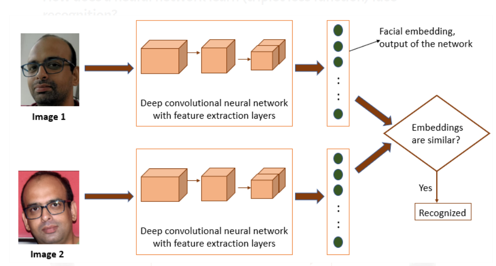
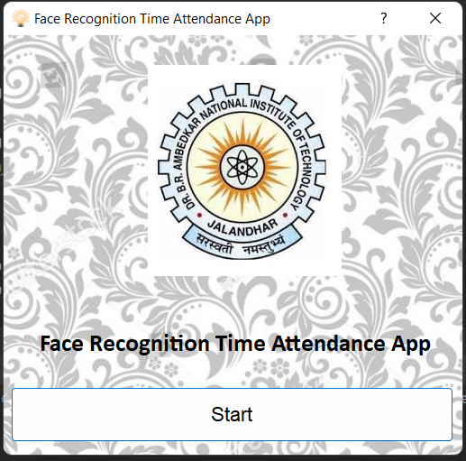
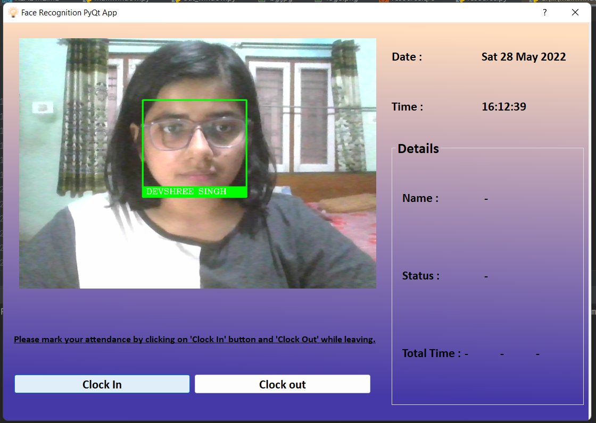
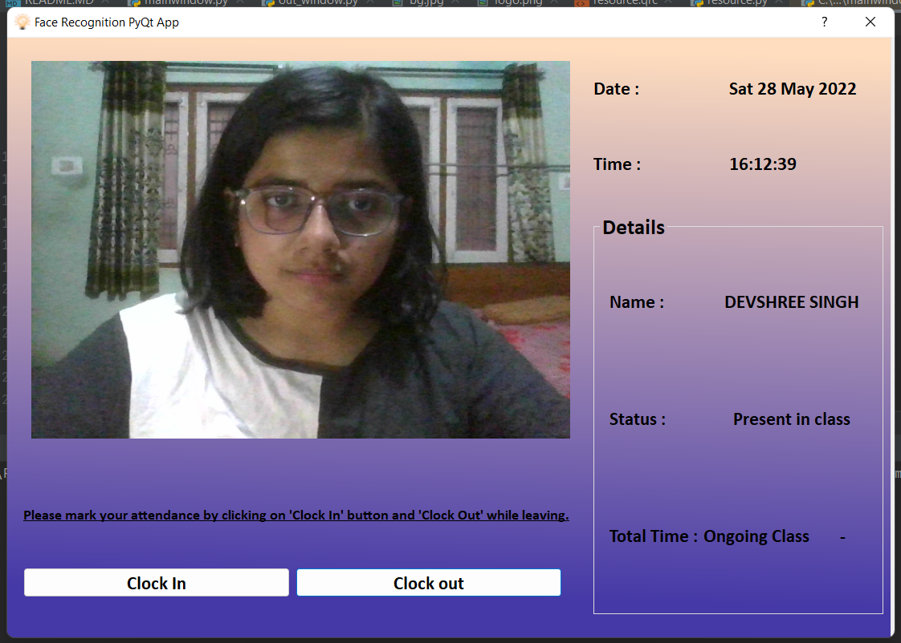

<h1 align="center">Face Recognition Attendance System
  
  
</h1>
<p align="center">

<details open="open">
  <summary>Table of Contents</summary>
  <ol>
    <li>
      <a href="#about-the-project">About The Project</a>
      <ul>
        <li><a href="#features">Features</a></li>
        <li><a href="#compatible-platforms">Compatible Platforms</a></li>
        <li><a href="#built-with">Built With</a></li>
      </ul>
    </li>
   <li>
      <a href="#getting-started">Getting Started</a>
       <ul>
         <li><a href="#prerequisites">Prerequisites</a></li> 
         <li><a href="#installation">Installation</a></li> 
       </ul>  
     </li> 
    <li><a href="#how-face-recognition-works">How face recognition works?</a></li>
    <li><a href="#preview-of-the-web-application">Preview of the Web Application</a></li>       <ul>
        <li><a href="#startup-screen">Startup Screen</a></li>
        <li><a href="#attendance-system-screen-face-recognition-result">Attendance System Screen-Face recognition result</a></li>
    <li><a href="#face-recognized">Face Recognized</a></li>
    <li><a href="#attendance-sheet-preview">Attendance sheet preview</a></li>
      </ul>
    <li><a href="#future-aspects">Future Aspects</a></li>
  </ol>
</details>

<!-- ABOUT THE PROJECT -->

## About The Project
* Face Detection Emotion Recognition project built during Microsoft Engage 2022 program. 
* It is a PyQt5 application through which we can detect the name of the person in front of the camera based on my model created. 
* Displays the name and the 'in' and 'out' time.
* Marks the respective attendance

### Features
* Creating and deleting images, adding and removing Users,designating the accessbility of users to admin site admin(me)

### Compatible Platforms
Laptops and Tablets

### Built With

### Web Application: 
  <ol>
    <li>
      Languages,IDE and GUI
      <ul>
        <li>Python,</li>
        <li>Microsoft VS Code</li>
        <li>PyQt5-designer</li>
      </ul>
    </li>
    <li>Python Libraries</li>
      <ul>
        <li>All libraries of requirements.txt file
           <ul>
               <li>numpy ,open-cv-python-headless,Pillow,sklearn,Dlib etc...</li>
           </ul>
        </li>
      </ul>
    <li>
      Database, Code Maintainance and Backend
      <ul>
        <li>Excel(csv)</li>
        <li>Git,GitHub </li>
      </ul>
    </li>
   
  </ol>
  
  <!-- INSTALLATIONS -->

## Getting Started
To install and run the project on your local system, following are the requirements:
### Prerequisites
Make sure to install the required dependencies 
Install Python from python.org
Install PyCharm Community Edition 2022.1.1

Install CMake first to install Dlib on windows 
```sh
  pip install dlib 
```
### Installation

* Web Application
To run the web application on your local host, perform the following steps:

Clone the GitHub Repo
Open the directory in command prompt where repo is cloned.
Install Required libraries in PyCharm
```sh
  pip install -r requirements.txt 
```

## How face recognition works?
#### Face Detection: 
dlib’s HOG(histogram of oriented gradient) detector is used for this.

Hog detector checks for each pixel in the image the surrounding pixels to the current pixel. It then draws arrows in the direction in which the image is getting darker. In the end, the entire image is filled with arrows. These arrows are called gradients and they show the flow from light to dark across the image. We check this pattern to the earlier known face pattern of gradients and extract only the face part.

The original image is turned into a HOG representation that captures the major features of the image regardless of image brightness.
To find faces in this HOG image, all we have to do is find the part of our image that looks the most similar to a known HOG pattern that was extracted from a bunch of other training faces.

I have used the HOG face detection module, which is the default for face-recognition library’s get face location function.

#### Face Encoding: 
convert that face image into numerical feature points that describe the face in the best possible way.
Now instead of comparing the entire face to al the faces in the database, we only compare some extracted features from the unknown face to all the known faces. For example, we might measure the size of each ear, the spacing between the eyes, the length of the nose, etc.
The training process works by looking at 3 face images at a time:

1.Load a training face image of a known person

2.Load another picture of the same known person

3.Load a picture of a totally different person

Then the algorithm looks at the measurements it is currently generating for each of those three images. It then tweaks the neural network slightly so that it makes sure the measurements it generates for #1 and #2 are slightly closer while making sure the measurements for #2 and #3 are slightly further apart. After repeating this step millions of times for millions of images of thousands of different people, the neural network learns to reliably generate 128 measurements for each person. Any ten different pictures of the same person should give roughly the same measurements.

#### Comparison: 
compare this feature vector to other faces vectors stored in the database. One that is closest to the input image vector and whose distance is less than the threshold is the predicted output.

I have used facial recognition using one-shot learning by a deep neural network.

##### What is one shot learning?
In one shot learning, only one image per person is stored in the database, which is passed through the neural network to generate an embedding vector. This embedding vector is compared with the vector generated for the person who has to be recognized. If there exist similarities between the two vectors then the system recognizes that person, else that person is not there in the database. This can be understood by the below picture.




<!-- APP TUTORIAL-->

## Preview of the Web Application

  ### StartUp screen



### Attendance System Screen-Face recognition result



### Face Recognized



### Attendance sheet preview


## Future Aspects

### Improvements
* More Reliability
* Scalability

### Future Aspects
By improving the project on reliability part and overall aspects,it can be used on a large scale.


